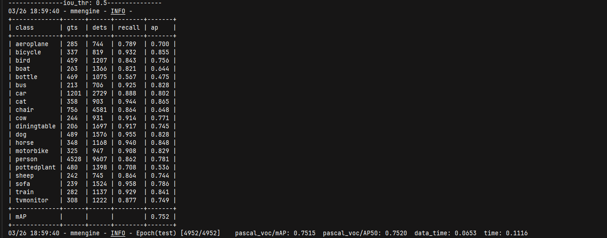

1. 训练了四轮 ， 大概花了 五个多小时
2. 经过四轮训练后，用测试集，测试结果如图
     
3. 训练自己的话，就在demo文件里面添加jpg文件  

        python .\demo\image_demo.py `
        .\demo\my_test.jpg `
        .\work_dirs\faster-rcnn_r50_fpn_1x_voc0712\faster-rcnn_r50_fpn_1x_voc0712.py `
        --weights .\work_dirs\faster-rcnn_r50_fpn_1x_voc0712\epoch_4.pth `
        --out-dir .\demo_results `
        --pred-score-thr 0.5 