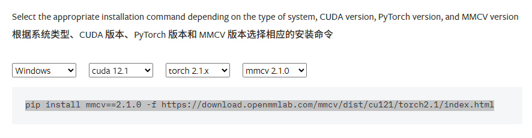

# 配置mmdection环境
## 一、用conda创建虚拟环境
用anaconda prompt打开  

    conda create --name  mmdet python=3.9 anaconda   
下载完后激活  

    conda activate mmdet

>其中 mmdet 是你自己的名字 , 加 anaconda 是我学到教程

## 二、下载CUDA 
直接去官网下载：[https://developer.nvidia.com/cuda-12-1-0-download-archive](https://developer.nvidia.com/cuda-12-1-0-download-archive)  
下载CUDA 12.1   
里面选择 windows / x86_64 / **11**(这个可能有区别) / exe(local)  
下载之后要添加环境变量  

    > C:\Program Files\NVIDIA GPU Computing Toolkit\CUDA\v12.1\libnvvp  

    > C:\Program Files\NVIDIA GPU Computing Toolkit\CUDA\v12.1\bin  
这个具体路径要自己找，关键是找 libnvvp 和 bin 两个文件夹
## 三、下载pytorch
    pip install torch==2.1.0 torchvision==0.16.0 torchaudio==2.1.0 --index-url https://download.pytorch.org/whl/cu121  
简单粗暴，直接下载跟CUDA12.1相应的torch版本，如下图
## 四、下载MMCV
    pip install mmcv==2.1.0 -f https://download.openmmlab.com/mmcv/dist/cu121/torch2.1/index.html
这里我在官网找的 , 其中我选 mmcv = 2.1.0，因为我下完 2.2.0后，用mmdection会出错，还要改里面 _init.py中最大最小版本。   
这是官网地址[MMCV](https://mmcv.readthedocs.io/en/latest/get_started/installation.html),可以找自己对应cuda 和 torch 的版本

当然，我用过官网给的教程，但是正如官网所说，我当时只有.zip，而不是.whl。不过前两句应该是需要的

     pip install -U openmim  
     mim install mmengine  
     mim install "mmcv>=2.0.0"    

这是官网教程[mmdetection](https://mmdetection.readthedocs.io/zh-cn/latest/get_started.html)
## 五、cloneMMdection
    git clone https://github.com/open-mmlab/mmdetection.git
    cd mmdetection
    pip install -v -e .      
其实这样，在C盘路径下装了mmdection，不过也无所谓了，以后会了，改了就行。   
其中pip install -v -e这样才有mmdet
## 插曲
我在这过程中，好像还有numpy版本的问题，我当时问了AI  

    pip install "opencv-python<4.9"
    pip install "numpy<2"

这样用低版本的numpy
## 总结
这大概是我完整的步骤，以上很多都是我自己找的教程，写这个也只是为了让自己尝试一下，哈哈哈
