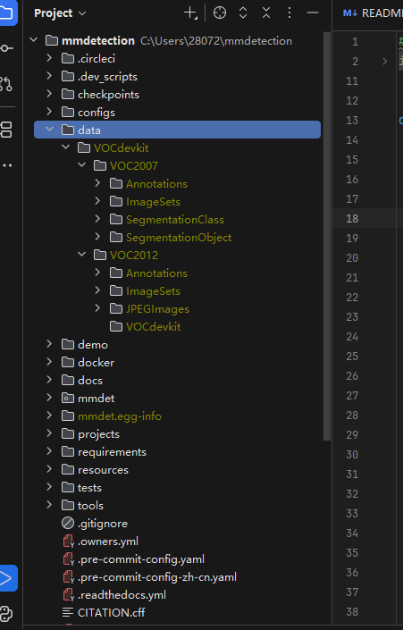
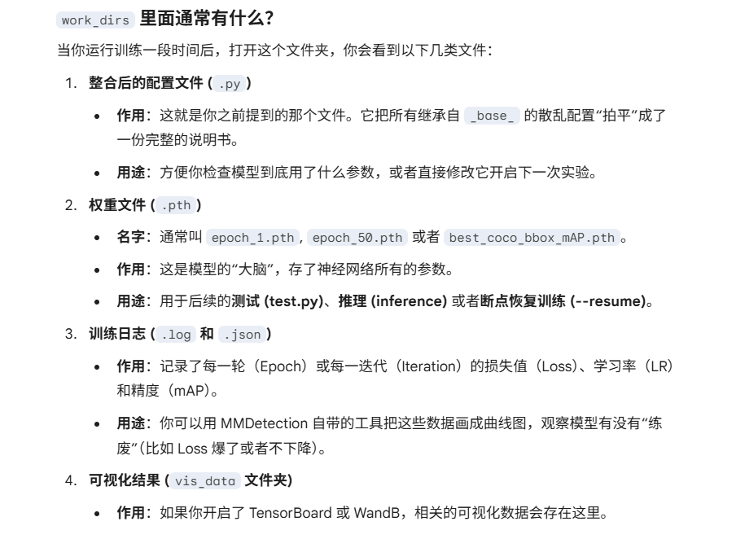
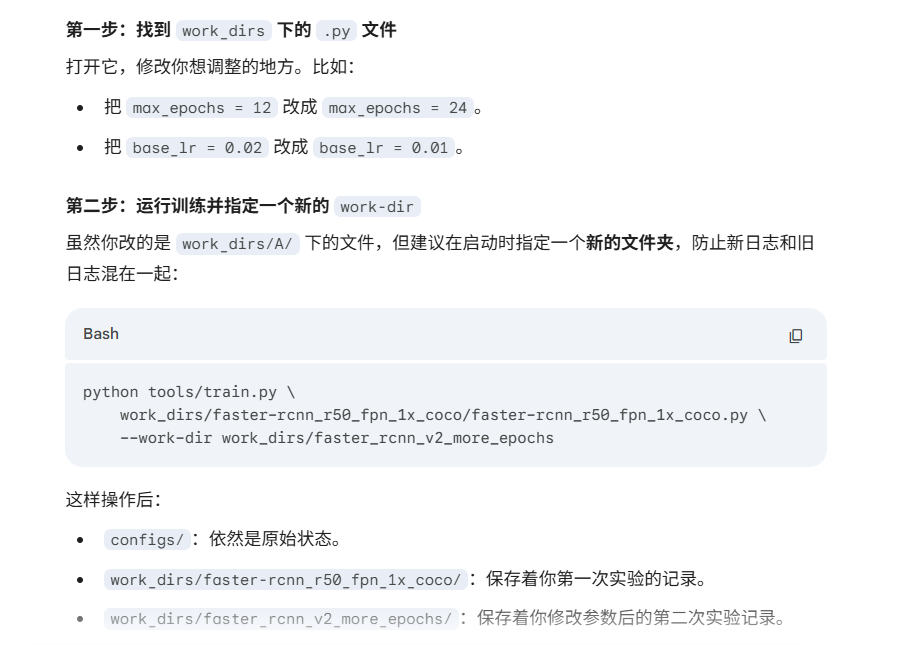

## 数据集
1. 数据集下载（https://mmdetection.readthedocs.io/zh-cn/latest/user_guides/useful_tools.html#id18）  
2. 数据集准备（https://mmdetection.readthedocs.io/zh-cn/latest/user_guides/dataset_prepare.html）  
 >解压实在是太逆天了，我开始下来四个2007的压缩包和三个2012的压缩包 ，先在mmdetection中新建一个data文件夹，在再解压这几个压缩包时选到data，我最开始同时解压，好像一坨，然后我就一个一个解压，都解压在data下面，然后会自动合并出VOC2007和VOC2012

文件夹结构如下 

## 具体训练：
1.  直接开始训练好吧，这样可以在work_dirs里面自动创建一个于配置文件同名的文件夹 

        python tools/train.py configs/xxx/your_config.py
    >关于work_dirs：   
    可以把work_dirs里面是实验，config里面是原始模板库。
    
    
2.  训练  

        python .\tools\train.py `
        .\work_dirs\faster-rcnn_r50_fpn_1x_coco\faster-rcnn_r50_fpn_1x_coco.py `
        --amp
    > --amp (可选)：强烈建议开启。它可以开启“自动混合精度”，显著降低 RTX 3060 的显存压力，并加快训练速度。 

    > --resume (可选)：如果训练中途断了，加上这个参数会自动接着最后一次生成的 .pth 文件往后练。
  
3. 测试  
    >  python .\tools\test.py <work_dirs中的完整配置文件路径><选中的权重文件路径> [可选参数]  

    >例子  

        python .\tools\test.py `
            .\work_dirs\faster-rcnn_r50_fpn_1x_coco\faster-rcnn_r50_fpn_1x_coco.py `
            .\work_dirs\faster-rcnn_r50_fpn_1x_coco\epoch_12.pth `
            --show-dir .\vis_results
    ><权重文件路径>：通常选择 epoch_数字.pth。如果你想看最终效果，选数字最大的那个。

    >--show-dir (可选)：指定一个文件夹（如 .\vis_results），程序会把检测好、画上框的图片全存进去。